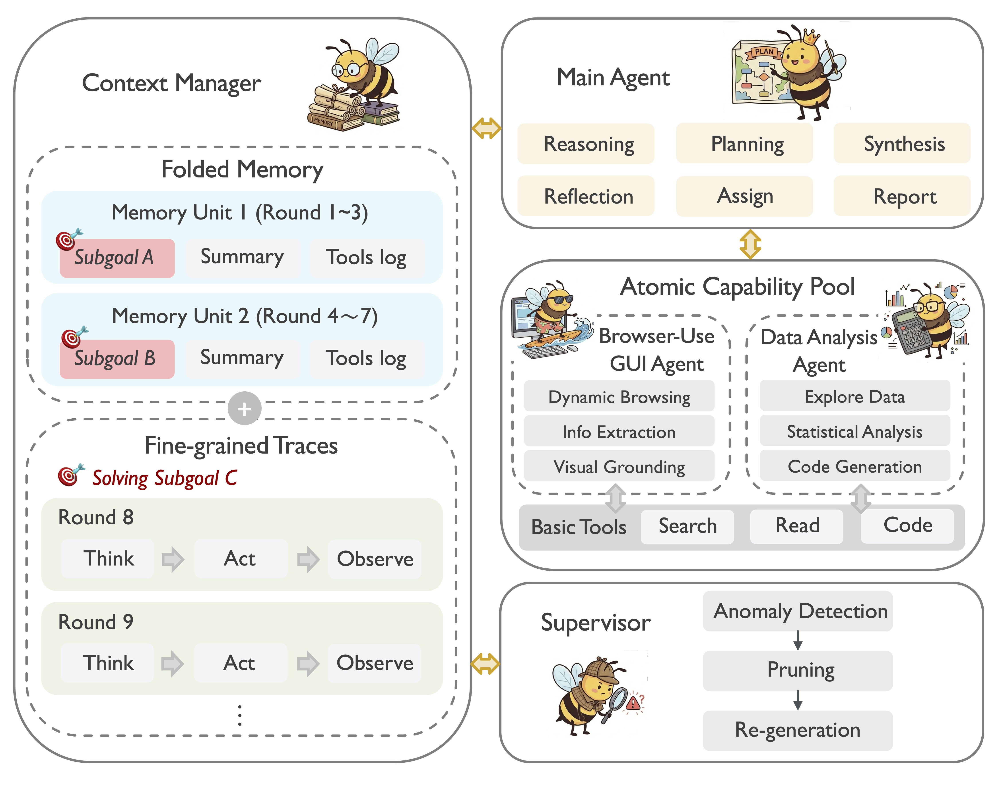

# Yunque DeepResearch

## Architecture

<p align="center">
  
</p>

More details can be found in our Tech Report (Coming Soon).

### Features

- **Effective Orchestration**: We introduce an adaptive planning architecture where the Main Agent acts as a central conductor. Utilizing a flexible dispatch mechanism, the planner dynamically routes tasks to the most appropriate resource within the Atomic Capability Pool: it directly invokes basic tools for low-latency atomic operations while delegating complex, long-horizon objectives to specialized sub-agents.
- **Adaptive Structured Memory**: We propose a **sub-goal-driven memory mechanism** to balance context length with information density. By treating sub-goals as the fundamental unit of trajectory segmentation, our system dynamically partitions the research process. Completed sub-goals are "folded" into concise summaries to maintain global planning awareness, while the active sub-goal retains fine-grained ReAct traces for precise execution. This hybrid approach transforms linear history into structured semantic milestones.
- **Modularity and Extensibility**: We establish a unified **"Atomic Capability Pool"** that decouples the reasoning core from execution details. By standardizing the interface for both lightweight basic tools (e.g., Search, Read) and complex specialized sub-agents, our architecture supports "plug-and-play" extensibility. This allows the system to seamlessly integrate novel capabilities—ranging from simple APIs to sophisticated domain solvers—adapting to evolving research domains without architectural overhaul.
- **Stability and Active Supervision**: We incorporate a dedicated **Supervisor module** to ensure system stability and mitigate the fragility often inherent in long-horizon tasks. Unlike rigid reflection schedules, this mechanism performs active anomaly detection on the agent's trajectory. Upon identifying failures, it triggers a self-correction protocol, explicitly pruning invalid context to prevent memory pollution and guiding the agent to autonomously recover and synthesize a viable alternative response.

## Quick Start

This guide provides instructions for setting up the environment and running inference scripts located in the [inference](./inference/) folder.

### 1. Environment Setup

```bash
conda create -n hivemind python=3.10.0
conda activate hivemind
pip install -r requirements.txt
```

### 2. Configuration & Data Preparation

Configure your API keys and settings by copying the example environment file:

```bash
# Copy the example environment file
cp .env.example .env
```

Edit the `.env` file and provide your actual API keys and configuration values:

- **SERPER_KEY_ID**: Your key from [Serper.dev](https://serper.dev/) (for web search and Google Scholar).
- **JINA_API_KEYS**: Your key from [Jina.ai](https://jina.ai/) (for web page reading).
- **API_KEY/API_BASE**: OpenAI-compatible API credentials (for page summarization and LLM).
- **SANDBOX_FUSION_ENDPOINT**: Python interpreter sandbox endpoints (see [SandboxFusion](https://github.com/bytedance/SandboxFusion)).
- **LLM_NAME**: The name of the model you wish to use.
- **DATASET**: Path to your evaluation dataset.
- **OUTPUT_PATH**: Directory for saving results.

#### Supported File Formats

The system supports the **JSONL** format. Create your data file (e.g., `my_questions.jsonl`) with the following structure:

```json
{"question": "What is the capital of France?", "answer": "Paris"}
{"question": "Explain quantum computing", "answer": ""}
```

**Note:** The `answer` field contains the **ground truth** used for automatic evaluation. The system generates its own responses, which are then compared against these reference answers.

### 3. Prepare API to call the model

The framework supports any **OpenAI-compatible API** (e.g., OpenAI, DeepSeek, vLLM, SGLang).

1. **Deployment**:
    - **External Providers**: Get your API Key and Base URL (e.g., `https://api.openai.com/v1`).
    - **Self-Hosted (vLLM/SGLang)**: Start your inference server.
        ```bash
        # Example: Launch vLLM server
        python -m vllm.entrypoints.openai.api_server \
          --model /path/to/your/model \
          --served-model-name my-model \
          --port 8000
        ```

2. **Configuration**:
    Update the `Agent API` section in your `.env` file to match your deployment:

    ```bash
    # The model name to request (must match the served model name)
    LLM_MODEL=my-model

    # API Endpoint Configuration
    AGENT_API_KEY=your_api_key  # Use "EMPTY" for local vLLM/SGLang if no auth
    AGENT_API_BASE=http://localhost:8000/v1
    ```

### 4. Run Inference

Execute the inference script using the provided wrapper:

```bash
bash run.sh
```

---

With these steps, you can fully prepare the environment, configure the dataset, and run the model. For more details, consult the inline comments in each script or open an issue.

## Acknowledgement

We thank the open-source community for their contributions, especially the authors of the following projects:

- [Tongyi DeepResearch](https://github.com/Alibaba-NLP/DeepResearch)
- [browser-use](https://github.com/browser-use/browser-use)
- [OpenManus](https://github.com/FoundationAgents/OpenManus)
